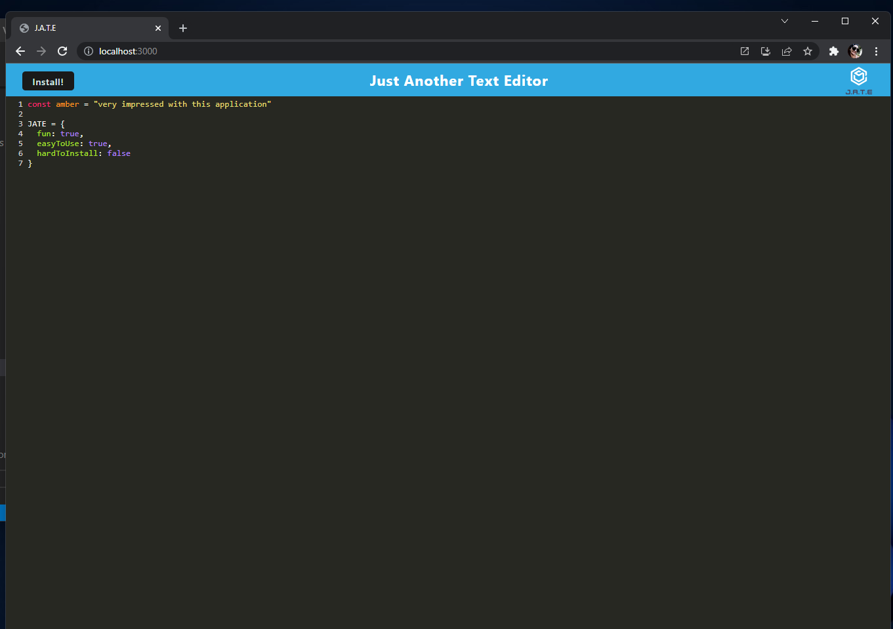
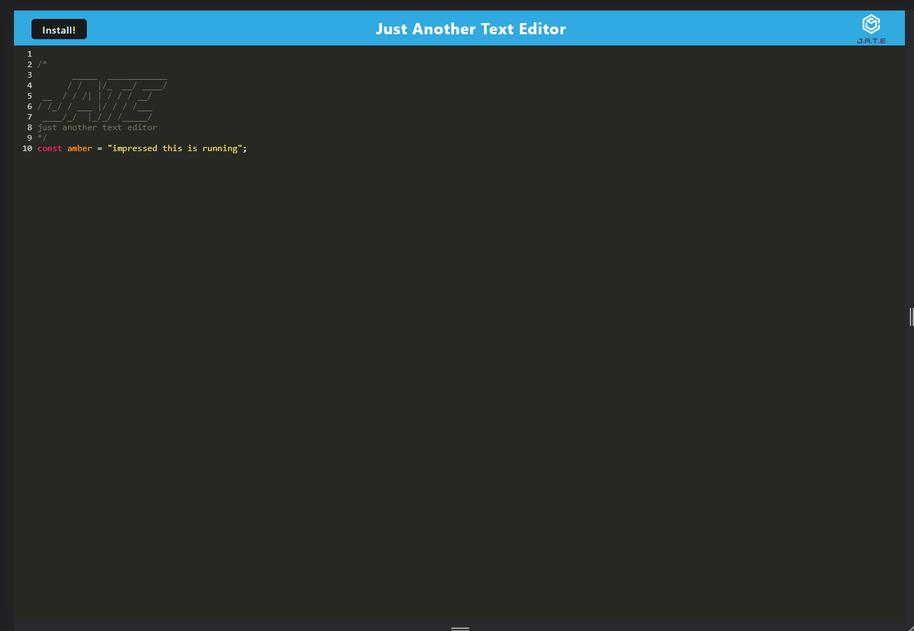
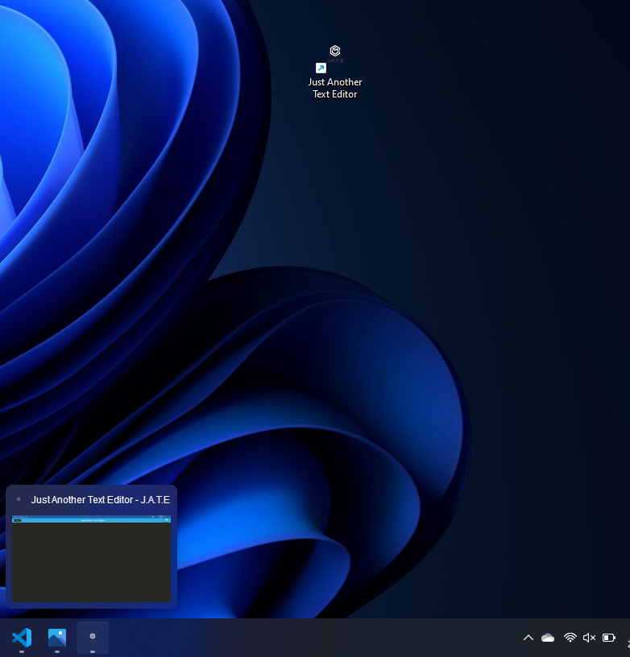

# J.A.T.E

 

 ## Description
 _This application was made for school, just another text editor. JATE was made using Node.js and using an express server, it is also deployed on heroku!_

Page is deployed at [https://intense-lowlands-93549.herokuapp.com](https://intense-lowlands-93549.herokuapp.com/ "link to deployed app")

---

  ## Table of Contents
  
  - [Usage](#usage)
  - [Installation](#installation)
  - [Screenshots](#screenshots)
  - [License](#license)
  - [Contributions](#how-to-contribute)
  - [Questions](#questions)

  ---

  ## Usage

However you would like as this is 'just another text editor'

---

  ## Installation
 
 This project is live on [heroku](https://intense-lowlands-93549.herokuapp.com/ "link to deployed app") and doesn't need to be installed!

  ---

  ## Screenshots

Here are some screen shots of this application.

    

  ---

  ## License

   MIT License

Copyright (c) [2022] [Amber Robeck]

Permission is hereby granted, free of charge, to any person obtaining a copy
of this software and associated documentation files (the "Software"), to deal
in the Software without restriction, including without limitation the rights
to use, copy, modify, merge, publish, distribute, sublicense, and/or sell
copies of the Software, and to permit persons to whom the Software is
furnished to do so, subject to the following conditions:

The above copyright notice and this permission notice shall be included in all
copies or substantial portions of the Software.

THE SOFTWARE IS PROVIDED "AS IS", WITHOUT WARRANTY OF ANY KIND, EXPRESS OR
IMPLIED, INCLUDING BUT NOT LIMITED TO THE WARRANTIES OF MERCHANTABILITY,
FITNESS FOR A PARTICULAR PURPOSE AND NONINFRINGEMENT. IN NO EVENT SHALL THE
AUTHORS OR COPYRIGHT HOLDERS BE LIABLE FOR ANY CLAIM, DAMAGES OR OTHER
LIABILITY, WHETHER IN AN ACTION OF CONTRACT, TORT OR OTHERWISE, ARISING FROM,
OUT OF OR IN CONNECTION WITH THE SOFTWARE OR THE USE OR OTHER DEALINGS IN THE
SOFTWARE.

  
  ---
  
  ## How to Contribute

     However you would like to contribute I always look forward to learning something new, feel free to email me!

  [Contributor Covenant](https://www.contributor-covenant.org/)

  ---

  ## Questions

* OR here

 

* OR here

